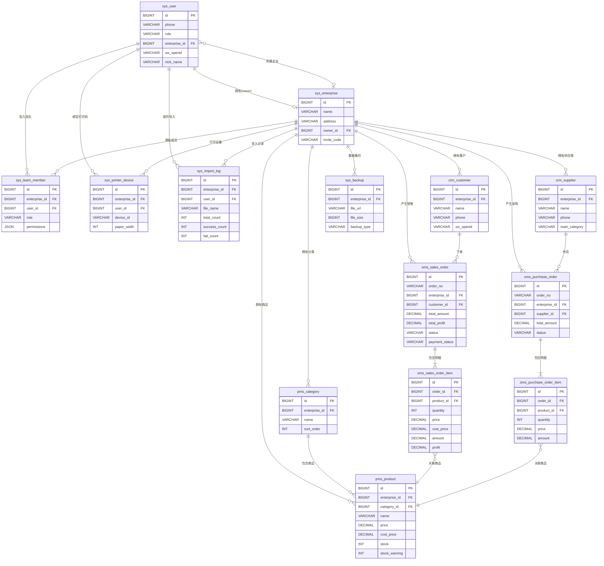
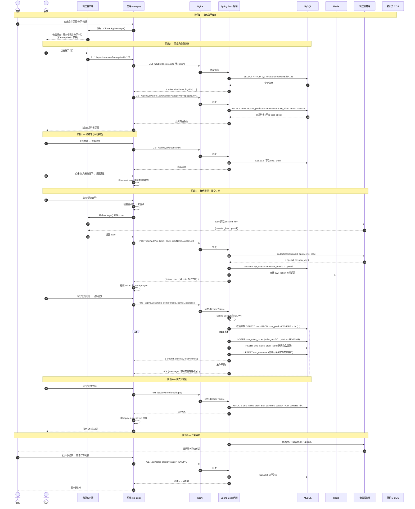
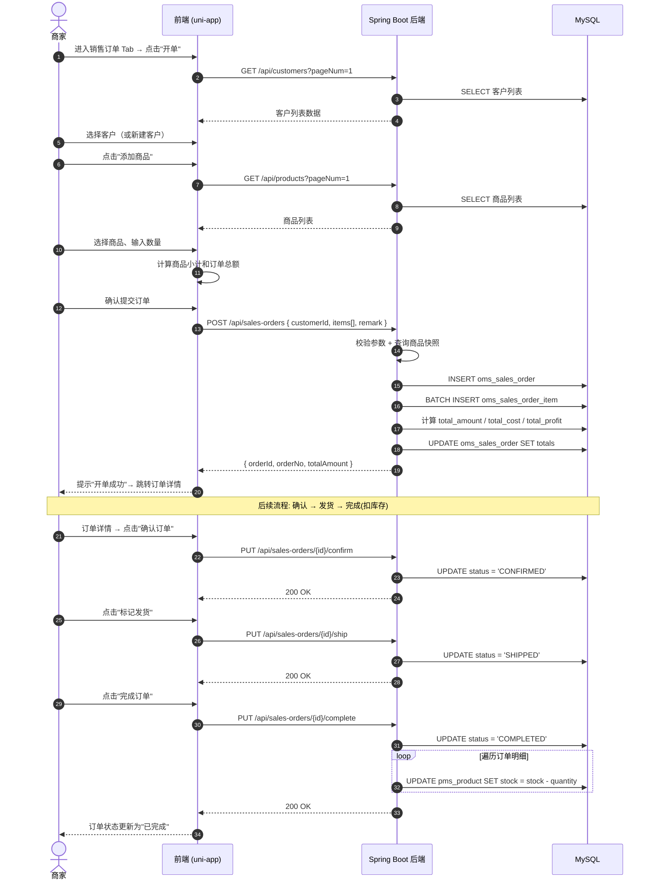
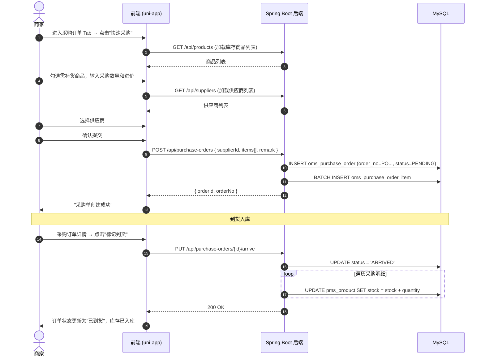

# 采购系统微信小程序 — 系统架构与数据设计

> **文档版本**：v1.0  
> **创建日期**：2026-03-01  
> **关联文档**：[PRD v1.4](./PRD.md)  
> **文档状态**：Phase One 第二部分

---

## 目录

1. [项目文件目录结构](#1-项目文件目录结构)
2. [数据库设计 (Schema)](#2-数据库设计-schema)
3. [API 设计](#3-api-设计)

---

## 1. 项目文件目录结构

本项目采用**前后端分离**架构，分为两个独立工程：

- **前端**：`procurement-uniapp/` — Vue 3 + uni-app (Vite 构建)
- **后端**：`procurement-server/` — Java 17 + Spring Boot 3.x

### 1.1 前端目录结构（Vue 3 + uni-app Vite）

```
procurement-uniapp/
├── src/
│   ├── api/                              # 后端 API 请求模块
│   │   ├── request.js                    # uni.request 封装（拦截器 + JWT 自动注入 + 错误处理）
│   │   ├── auth.js                       # 登录 / 注册 / 短信验证码
│   │   ├── enterprise.js                 # 企业信息 CRUD
│   │   ├── category.js                   # 商品分类 CRUD
│   │   ├── product.js                    # 商品 CRUD / 库存调整 / 批量导入
│   │   ├── salesOrder.js                 # 销售订单相关
│   │   ├── purchaseOrder.js              # 采购订单相关
│   │   ├── customer.js                   # 客户管理
│   │   ├── supplier.js                   # 供应商管理
│   │   ├── statistics.js                 # 统计报表
│   │   ├── team.js                       # 团队成员管理
│   │   ├── backup.js                     # 数据备份
│   │   ├── upload.js                     # 文件上传（腾讯云 COS）
│   │   └── buyer.js                      # 买家端接口
│   │
│   ├── components/                       # 可复用组件
│   │   ├── common/                       # 全局通用组件
│   │   │   ├── NavBar.vue                # 自定义导航栏
│   │   │   ├── EmptyState.vue            # 空状态占位页
│   │   │   ├── LoadMore.vue              # 上拉加载更多指示器
│   │   │   ├── ConfirmDialog.vue         # 二次确认弹窗
│   │   │   ├── SearchBar.vue             # 搜索栏
│   │   │   └── StatusTag.vue             # 状态标签（订单状态 / 支付状态）
│   │   ├── product/                      # 商品相关组件
│   │   │   ├── ProductCard.vue           # 商品列表卡片
│   │   │   ├── ProductForm.vue           # 商品表单（添加 / 编辑）
│   │   │   └── CategorySelector.vue      # 分类选择器
│   │   ├── order/                        # 订单相关组件
│   │   │   ├── OrderCard.vue             # 订单列表卡片
│   │   │   ├── OrderStatusTag.vue        # 订单状态标签
│   │   │   └── OrderItemList.vue         # 订单商品明细列表
│   │   ├── printer/                      # 蓝牙打印组件
│   │   │   ├── DeviceList.vue            # 蓝牙设备列表
│   │   │   └── PrintPreview.vue          # 小票打印预览
│   │   └── import/                       # 批量导入组件
│   │       ├── ExcelPreview.vue          # Excel 解析预览表格
│   │       └── ImportResult.vue          # 导入结果报告
│   │
│   ├── pages/                            # 页面文件
│   │   ├── auth/                         # 认证页面
│   │   │   └── login.vue                 # 手机号 + 验证码登录
│   │   ├── inventory/                    # 📦 库存 Tab
│   │   │   ├── index.vue                 # 库存首页（商品列表 + 分类筛选 + 搜索 + 批量导入入口）
│   │   │   ├── category.vue              # 商品分类管理页
│   │   │   ├── product-form.vue          # 添加 / 编辑商品页
│   │   │   ├── batch-import.vue          # 批量导入页（上传 → 预览 → 确认）
│   │   │   └── statistics.vue            # 库存统计页
│   │   ├── purchase/                     # 📋 采购订单 Tab
│   │   │   ├── index.vue                 # 采购订单列表（状态筛选）
│   │   │   ├── detail.vue                # 采购订单详情
│   │   │   ├── quick-purchase.vue        # 快速采购页（选商品 → 生成订单）
│   │   │   ├── supplier-list.vue         # 供应商列表
│   │   │   └── supplier-detail.vue       # 供应商详情 + 采购记录
│   │   ├── sales/                        # 🛒 销售订单 Tab
│   │   │   ├── index.vue                 # 销售订单列表（状态筛选）
│   │   │   ├── detail.vue                # 销售订单详情（含打印按钮）
│   │   │   ├── create-order.vue          # 开单（手动创建销售订单）
│   │   │   ├── customer-list.vue         # 客户列表
│   │   │   ├── customer-detail.vue       # 客户详情 + 历史订单
│   │   │   └── add-customer.vue          # 添加新客户
│   │   ├── statistics/                   # 📊 统计 Tab
│   │   │   └── index.vue                 # 统计概览（指标 + 图表 + 利润）
│   │   ├── profile/                      # 👤 我的 Tab
│   │   │   ├── index.vue                 # 个人中心（未创建 / 已创建企业两种状态）
│   │   │   ├── enterprise.vue            # 我的企业（信息编辑）
│   │   │   ├── create-enterprise.vue     # 创建企业
│   │   │   ├── team.vue                  # 我的团队（成员管理）
│   │   │   ├── printer.vue              # 蓝牙打印机管理（搜索 / 连接 / 设置纸宽）
│   │   │   └── backup.vue                # 数据备份
│   │   └── buyer/                        # 买家端页面（通过分享链接进入）
│   │       ├── store.vue                 # 商家库存浏览页
│   │       ├── product-detail.vue        # 商品详情页
│   │       ├── cart.vue                  # 采购清单（购物车）
│   │       ├── checkout.vue              # 提交订单（微信授权）
│   │       ├── pay-success.vue           # 支付成功页（伪支付）
│   │       └── orders.vue                # 我的订单（买家历史采购）
│   │
│   ├── store/                            # Pinia 状态管理
│   │   ├── index.js                      # Pinia 实例创建
│   │   ├── user.js                       # 用户状态（登录态、角色、Token）
│   │   ├── enterprise.js                 # 企业状态（企业信息缓存）
│   │   ├── cart.js                       # 买家购物车状态
│   │   └── printer.js                    # 蓝牙打印机连接状态
│   │
│   ├── utils/                            # 工具函数
│   │   ├── auth.js                       # Token 存取（uni.setStorageSync / getStorageSync）
│   │   ├── format.js                     # 日期 / 金额 / 手机号格式化
│   │   ├── validate.js                   # 表单校验规则（手机号、价格、必填项）
│   │   ├── bluetooth.js                  # 蓝牙适配器管理（搜索、连接、发送数据）
│   │   ├── escpos.js                     # ESC/POS 打印指令构建器（排版、字号、表格）
│   │   └── excel.js                      # SheetJS Excel 解析 + 数据校验
│   │
│   ├── static/                           # 静态资源
│   │   ├── images/                       # 图片资源（logo、空状态图等）
│   │   └── templates/                    # Excel 导入模板文件
│   │
│   ├── uni_modules/                      # uni-app 插件模块（uni-ui 等）
│   ├── App.vue                           # 根组件（全局生命周期）
│   ├── main.js                           # 入口文件（注册 Pinia、全局配置）
│   ├── manifest.json                     # uni-app 应用配置（AppID、权限等）
│   ├── pages.json                        # 页面路由 + TabBar 配置
│   └── uni.scss                          # 全局 SCSS 变量
│
├── index.html                            # HTML 入口
├── vite.config.js                        # Vite 构建配置
├── package.json                          # 依赖管理
└── README.md                             # 前端工程说明
```

### 1.2 后端目录结构（Java 17 + Spring Boot 3.x）

```
procurement-server/
├── src/
│   ├── main/
│   │   ├── java/com/procurement/
│   │   │   ├── ProcurementApplication.java           # Spring Boot 启动类
│   │   │   │
│   │   │   ├── config/                               # 配置类
│   │   │   │   ├── SecurityConfig.java               # Spring Security 配置（白名单、过滤链）
│   │   │   │   ├── MyBatisPlusConfig.java            # 分页插件、自动填充处理器、逻辑删除
│   │   │   │   ├── CorsConfig.java                   # CORS 跨域白名单
│   │   │   │   ├── RedisConfig.java                  # Redis 序列化 + 连接配置
│   │   │   │   ├── CosConfig.java                    # 腾讯云 COS 客户端初始化
│   │   │   │   ├── WxConfig.java                     # 微信小程序 AppID / Secret 配置
│   │   │   │   └── Knife4jConfig.java                # Swagger / Knife4j API 文档配置
│   │   │   │
│   │   │   ├── common/                               # 公共模块
│   │   │   │   ├── result/
│   │   │   │   │   ├── R.java                        # 统一响应体 { code, message, data }
│   │   │   │   │   └── ResultCode.java               # 响应码枚举（SUCCESS / FAIL / UNAUTHORIZED...）
│   │   │   │   ├── exception/
│   │   │   │   │   ├── BusinessException.java        # 业务异常
│   │   │   │   │   └── GlobalExceptionHandler.java   # 全局异常处理（@RestControllerAdvice）
│   │   │   │   ├── constant/
│   │   │   │   │   ├── OrderConstants.java           # 订单状态枚举常量
│   │   │   │   │   ├── UserConstants.java            # 用户角色枚举常量
│   │   │   │   │   └── CommonConstants.java          # 通用常量（分页默认值等）
│   │   │   │   └── base/
│   │   │   │       ├── BaseEntity.java               # 公共字段（id, createdAt, updatedAt, isDeleted）
│   │   │   │       └── PageRequest.java              # 分页请求基类（pageNum, pageSize）
│   │   │   │
│   │   │   ├── security/                             # 安全认证模块
│   │   │   │   ├── JwtTokenProvider.java             # JWT 生成 / 解析 / 验证
│   │   │   │   ├── JwtAuthFilter.java                # JWT 认证过滤器（OncePerRequestFilter）
│   │   │   │   ├── UserDetailsServiceImpl.java       # 自定义用户认证加载
│   │   │   │   └── LoginUser.java                    # 安全上下文用户对象
│   │   │   │
│   │   │   ├── controller/                           # 控制器层（接收请求）
│   │   │   │   ├── AuthController.java               # 认证：登录 / 注册 / 短信
│   │   │   │   ├── EnterpriseController.java         # 企业管理
│   │   │   │   ├── CategoryController.java           # 商品分类
│   │   │   │   ├── ProductController.java            # 商品管理 + 批量导入
│   │   │   │   ├── SalesOrderController.java         # 销售订单
│   │   │   │   ├── PurchaseOrderController.java      # 采购订单
│   │   │   │   ├── CustomerController.java           # 客户管理
│   │   │   │   ├── SupplierController.java           # 供应商管理
│   │   │   │   ├── StatisticsController.java         # 统计报表
│   │   │   │   ├── TeamController.java               # 团队管理
│   │   │   │   ├── BackupController.java             # 数据备份
│   │   │   │   ├── FileController.java               # 文件上传（COS）
│   │   │   │   └── BuyerController.java              # 买家端接口（浏览 / 下单）
│   │   │   │
│   │   │   ├── service/                              # 服务层（业务逻辑）
│   │   │   │   ├── AuthService.java
│   │   │   │   ├── EnterpriseService.java
│   │   │   │   ├── CategoryService.java
│   │   │   │   ├── ProductService.java
│   │   │   │   ├── SalesOrderService.java
│   │   │   │   ├── PurchaseOrderService.java
│   │   │   │   ├── CustomerService.java
│   │   │   │   ├── SupplierService.java
│   │   │   │   ├── StatisticsService.java
│   │   │   │   ├── TeamService.java
│   │   │   │   ├── BackupService.java
│   │   │   │   ├── FileService.java
│   │   │   │   ├── SmsService.java                   # 腾讯云短信发送
│   │   │   │   ├── WxService.java                    # 微信登录凭证校验（code2Session）
│   │   │   │   └── impl/                             # Service 接口实现类
│   │   │   │       ├── AuthServiceImpl.java
│   │   │   │       ├── EnterpriseServiceImpl.java
│   │   │   │       ├── CategoryServiceImpl.java
│   │   │   │       ├── ProductServiceImpl.java
│   │   │   │       ├── SalesOrderServiceImpl.java
│   │   │   │       ├── PurchaseOrderServiceImpl.java
│   │   │   │       ├── CustomerServiceImpl.java
│   │   │   │       ├── SupplierServiceImpl.java
│   │   │   │       ├── StatisticsServiceImpl.java
│   │   │   │       ├── TeamServiceImpl.java
│   │   │   │       ├── BackupServiceImpl.java
│   │   │   │       ├── FileServiceImpl.java
│   │   │   │       ├── SmsServiceImpl.java
│   │   │   │       └── WxServiceImpl.java
│   │   │   │
│   │   │   ├── mapper/                               # 数据访问层（MyBatis-Plus Mapper）
│   │   │   │   ├── UserMapper.java
│   │   │   │   ├── EnterpriseMapper.java
│   │   │   │   ├── CategoryMapper.java
│   │   │   │   ├── ProductMapper.java
│   │   │   │   ├── SalesOrderMapper.java
│   │   │   │   ├── SalesOrderItemMapper.java
│   │   │   │   ├── PurchaseOrderMapper.java
│   │   │   │   ├── PurchaseOrderItemMapper.java
│   │   │   │   ├── CustomerMapper.java
│   │   │   │   ├── SupplierMapper.java
│   │   │   │   ├── TeamMemberMapper.java
│   │   │   │   ├── BackupMapper.java
│   │   │   │   ├── PrinterDeviceMapper.java
│   │   │   │   └── ImportLogMapper.java
│   │   │   │
│   │   │   ├── entity/                               # 数据库实体类
│   │   │   │   ├── SysUser.java
│   │   │   │   ├── SysEnterprise.java
│   │   │   │   ├── PmsCategory.java
│   │   │   │   ├── PmsProduct.java
│   │   │   │   ├── OmsSalesOrder.java
│   │   │   │   ├── OmsSalesOrderItem.java
│   │   │   │   ├── OmsPurchaseOrder.java
│   │   │   │   ├── OmsPurchaseOrderItem.java
│   │   │   │   ├── CrmCustomer.java
│   │   │   │   ├── CrmSupplier.java
│   │   │   │   ├── SysTeamMember.java
│   │   │   │   ├── SysBackup.java
│   │   │   │   ├── SysPrinterDevice.java
│   │   │   │   └── SysImportLog.java
│   │   │   │
│   │   │   └── dto/                                  # 数据传输对象
│   │   │       ├── request/                          # 请求 DTO（前端 → 后端）
│   │   │       │   ├── LoginRequest.java             # { phone, code }
│   │   │       │   ├── WxLoginRequest.java           # { code (微信 login code) }
│   │   │       │   ├── EnterpriseRequest.java        # { name, address, contactPhone, ... }
│   │   │       │   ├── CategoryRequest.java          # { name, sortOrder }
│   │   │       │   ├── ProductRequest.java           # { categoryId, name, spec, unit, price, ... }
│   │   │       │   ├── StockAdjustRequest.java       # { productId, quantity, type: IN/OUT }
│   │   │       │   ├── SalesOrderRequest.java        # { customerId, items: [{productId, quantity}], remark }
│   │   │       │   ├── PurchaseOrderRequest.java     # { supplierId, items: [{productId, quantity, price}], remark }
│   │   │       │   ├── CustomerRequest.java          # { name, phone, address }
│   │   │       │   ├── SupplierRequest.java          # { name, phone, address, mainCategory }
│   │   │       │   ├── TeamPermissionRequest.java    # { permissions: {...} }
│   │   │       │   ├── BatchImportRequest.java       # { items: [{categoryName, name, spec, ...}], duplicateStrategy }
│   │   │       │   └── BuyerOrderRequest.java        # { enterpriseId, items: [{productId, quantity}], address }
│   │   │       └── response/                         # 响应 DTO（后端 → 前端）
│   │   │           ├── LoginResponse.java            # { token, userInfo }
│   │   │           ├── EnterpriseResponse.java       # { id, name, address, ... }
│   │   │           ├── ProductResponse.java          # { id, name, spec, price, stock, images, ... }
│   │   │           ├── SalesOrderResponse.java       # { orderNo, status, items, totalAmount, ... }
│   │   │           ├── PurchaseOrderResponse.java    # { orderNo, status, items, supplier, ... }
│   │   │           ├── CustomerResponse.java         # { id, name, phone, orderCount, ... }
│   │   │           ├── SupplierResponse.java         # { id, name, phone, purchaseCount, ... }
│   │   │           ├── StatOverviewResponse.java     # { todaySales, monthSales, inventoryValue, ... }
│   │   │           ├── SalesTrendResponse.java       # { date, amount, profit }[]
│   │   │           ├── SalesRankingResponse.java     # { productName, totalAmount, totalQuantity }[]
│   │   │           ├── ImportResultResponse.java     # { totalCount, successCount, failCount, ... }
│   │   │           └── PageResponse.java             # { records, total, pageNum, pageSize }
│   │   │
│   │   └── resources/
│   │       ├── application.yml                       # 主配置（公共配置、激活 profile）
│   │       ├── application-dev.yml                   # 开发环境配置（本地 MySQL / Redis）
│   │       ├── application-prod.yml                  # 生产环境配置（腾讯云 MySQL / Redis）
│   │       ├── mapper/                               # MyBatis XML 映射（复杂查询）
│   │       │   ├── SalesOrderMapper.xml
│   │       │   ├── PurchaseOrderMapper.xml
│   │       │   └── StatisticsMapper.xml
│   │       └── templates/                            # Excel 导入模板
│   │           └── product-import-template.xlsx
│   │
│   └── test/
│       └── java/com/procurement/
│           ├── controller/                           # Controller 层测试
│           ├── service/                              # Service 层测试
│           └── ProcurementApplicationTests.java
│
├── sql/
│   └── init.sql                                      # 数据库初始化脚本（建表 + 初始数据）
├── pom.xml                                           # Maven 依赖管理
├── Dockerfile                                        # Docker 构建文件（可选）
└── README.md                                         # 后端工程说明
```

### 1.3 整体工程结构

```
procurement-system-uniapp/                  # 项目根目录
├── procurement-uniapp/                     # 前端工程
├── procurement-server/                     # 后端工程
├── dev-rules/                              # 开发规则文档
├── prompt/
│   ├── image/                              # 参考截图
│   └── markdown/                           # 项目文档
│       ├── PRD.md                          # 产品需求文档
│       ├── ARCHITECTURE.md                 # 系统架构文档（本文档）
│       └── TASKS.md                        # 原子化任务清单
└── README.md                               # 项目总体说明
```

---

## 2. 数据库设计 (Schema)

### 2.1 ER 实体关系图



### 2.2 数据表详细设计

> **公共字段**：以下所有表均包含公共字段，不再重复列出：
>
> | 字段 | 类型 | 约束 | 说明 |
> |------|------|------|------|
> | `id` | BIGINT | PK, AUTO_INCREMENT | 主键 |
> | `created_at` | DATETIME | NOT NULL, DEFAULT CURRENT_TIMESTAMP | 创建时间 |
> | `updated_at` | DATETIME | NOT NULL, DEFAULT CURRENT_TIMESTAMP ON UPDATE CURRENT_TIMESTAMP | 更新时间 |
> | `is_deleted` | TINYINT(1) | NOT NULL, DEFAULT 0 | 逻辑删除（0=正常，1=已删除） |

---

#### 2.2.1 `sys_user` — 用户表

| 字段 | 类型 | 约束 | 说明 |
|------|------|------|------|
| `phone` | VARCHAR(20) | UNIQUE, NOT NULL | 手机号（商家登录凭证） |
| `password_hash` | VARCHAR(255) | | 密码哈希（BCrypt，预留字段） |
| `role` | VARCHAR(20) | NOT NULL, DEFAULT 'SELLER' | 用户角色：SELLER / MEMBER / BUYER |
| `enterprise_id` | BIGINT | FK → `sys_enterprise.id`, NULLABLE | 所属企业（买家无此关联） |
| `wx_openid` | VARCHAR(128) | UNIQUE, NULLABLE | 微信 OpenID（买家授权后绑定） |
| `wx_union_id` | VARCHAR(128) | NULLABLE | 微信 UnionID（预留跨平台） |
| `nick_name` | VARCHAR(50) | | 昵称 |
| `avatar_url` | VARCHAR(500) | | 头像 URL |
| `last_login_at` | DATETIME | NULLABLE | 最后登录时间 |

**索引**：
- `uk_phone` — UNIQUE(`phone`)
- `uk_wx_openid` — UNIQUE(`wx_openid`)
- `idx_enterprise_id` — INDEX(`enterprise_id`)

---

#### 2.2.2 `sys_enterprise` — 企业表

| 字段 | 类型 | 约束 | 说明 |
|------|------|------|------|
| `name` | VARCHAR(100) | NOT NULL | 企业名称 |
| `address` | VARCHAR(300) | | 企业地址 |
| `contact_phone` | VARCHAR(20) | | 联系电话 |
| `contact_name` | VARCHAR(50) | | 联系人 |
| `owner_id` | BIGINT | FK → `sys_user.id`, NOT NULL, UNIQUE | 企业主用户 ID |
| `invite_code` | VARCHAR(20) | UNIQUE | 团队邀请码 |
| `logo_url` | VARCHAR(500) | | 企业 Logo URL |

**索引**：
- `uk_owner_id` — UNIQUE(`owner_id`)
- `uk_invite_code` — UNIQUE(`invite_code`)

---

#### 2.2.3 `pms_category` — 商品分类表

| 字段 | 类型 | 约束 | 说明 |
|------|------|------|------|
| `enterprise_id` | BIGINT | FK → `sys_enterprise.id`, NOT NULL | 所属企业（数据隔离） |
| `name` | VARCHAR(50) | NOT NULL | 分类名称 |
| `sort_order` | INT | NOT NULL, DEFAULT 0 | 排序值（升序） |

**索引**：
- `idx_enterprise_id` — INDEX(`enterprise_id`)
- `uk_enterprise_name` — UNIQUE(`enterprise_id`, `name`, `is_deleted`) — 同企业下分类名唯一

---

#### 2.2.4 `pms_product` — 商品表

| 字段 | 类型 | 约束 | 说明 |
|------|------|------|------|
| `enterprise_id` | BIGINT | FK → `sys_enterprise.id`, NOT NULL | 所属企业 |
| `category_id` | BIGINT | FK → `pms_category.id`, NOT NULL | 所属分类 |
| `name` | VARCHAR(100) | NOT NULL | 商品名称 |
| `spec` | VARCHAR(200) | | 规格型号 |
| `unit` | VARCHAR(20) | NOT NULL | 计量单位（箱、瓶、kg 等） |
| `price` | DECIMAL(10,2) | NOT NULL | 销售单价 |
| `cost_price` | DECIMAL(10,2) | NOT NULL, DEFAULT 0.00 | 成本价（利润计算） |
| `stock` | INT | NOT NULL, DEFAULT 0 | 当前库存量 |
| `stock_warning` | INT | NOT NULL, DEFAULT 0 | 库存预警阈值（0=不预警） |
| `images` | JSON | | 商品图片 URL 数组，如 `["url1","url2"]` |
| `status` | TINYINT(1) | NOT NULL, DEFAULT 1 | 状态：1=上架，0=下架 |

**索引**：
- `idx_enterprise_id` — INDEX(`enterprise_id`)
- `idx_category_id` — INDEX(`category_id`)
- `idx_enterprise_category` — INDEX(`enterprise_id`, `category_id`)
- `idx_stock_warning` — INDEX(`enterprise_id`, `stock`, `stock_warning`) — 库存预警查询

---

#### 2.2.5 `oms_sales_order` — 销售订单主表

| 字段 | 类型 | 约束 | 说明 |
|------|------|------|------|
| `order_no` | VARCHAR(30) | UNIQUE, NOT NULL | 订单编号（规则：`SO` + 年月日 + 4位序号） |
| `enterprise_id` | BIGINT | FK → `sys_enterprise.id`, NOT NULL | 所属企业 |
| `customer_id` | BIGINT | FK → `crm_customer.id`, NULLABLE | 客户（线上下单关联，手动开单可为空） |
| `total_amount` | DECIMAL(12,2) | NOT NULL, DEFAULT 0.00 | 订单总金额 |
| `total_cost` | DECIMAL(12,2) | NOT NULL, DEFAULT 0.00 | 订单总成本 |
| `total_profit` | DECIMAL(12,2) | NOT NULL, DEFAULT 0.00 | 订单毛利润 = total_amount - total_cost |
| `status` | VARCHAR(20) | NOT NULL, DEFAULT 'PENDING' | 订单状态：PENDING / CONFIRMED / SHIPPED / COMPLETED / CANCELLED |
| `payment_status` | VARCHAR(20) | NOT NULL, DEFAULT 'UNPAID' | 支付状态：UNPAID / PAID |
| `remark` | VARCHAR(500) | | 订单备注 |

**索引**：
- `uk_order_no` — UNIQUE(`order_no`)
- `idx_enterprise_id` — INDEX(`enterprise_id`)
- `idx_enterprise_status` — INDEX(`enterprise_id`, `status`)
- `idx_customer_id` — INDEX(`customer_id`)
- `idx_created_at` — INDEX(`enterprise_id`, `created_at`) — 时间范围统计查询

---

#### 2.2.6 `oms_sales_order_item` — 销售订单明细表

| 字段 | 类型 | 约束 | 说明 |
|------|------|------|------|
| `order_id` | BIGINT | FK → `oms_sales_order.id`, NOT NULL | 所属订单 |
| `product_id` | BIGINT | FK → `pms_product.id`, NOT NULL | 关联商品 |
| `product_name` | VARCHAR(100) | NOT NULL | 商品名称（快照：下单时冻结） |
| `spec` | VARCHAR(200) | | 规格（快照） |
| `unit` | VARCHAR(20) | NOT NULL | 单位（快照） |
| `quantity` | INT | NOT NULL | 购买数量 |
| `price` | DECIMAL(10,2) | NOT NULL | 单价（快照） |
| `cost_price` | DECIMAL(10,2) | NOT NULL, DEFAULT 0.00 | 成本价（快照） |
| `amount` | DECIMAL(12,2) | NOT NULL | 小计金额 = price × quantity |
| `profit` | DECIMAL(12,2) | NOT NULL, DEFAULT 0.00 | 小计利润 = (price - cost_price) × quantity |

**索引**：
- `idx_order_id` — INDEX(`order_id`)
- `idx_product_id` — INDEX(`product_id`)

---

#### 2.2.7 `oms_purchase_order` — 采购订单主表

| 字段 | 类型 | 约束 | 说明 |
|------|------|------|------|
| `order_no` | VARCHAR(30) | UNIQUE, NOT NULL | 订单编号（规则：`PO` + 年月日 + 4位序号） |
| `enterprise_id` | BIGINT | FK → `sys_enterprise.id`, NOT NULL | 所属企业 |
| `supplier_id` | BIGINT | FK → `crm_supplier.id`, NULLABLE | 供应商 |
| `total_amount` | DECIMAL(12,2) | NOT NULL, DEFAULT 0.00 | 采购总金额 |
| `status` | VARCHAR(20) | NOT NULL, DEFAULT 'PENDING' | 采购状态：PENDING / PURCHASING / ARRIVED / COMPLETED / CANCELLED |
| `remark` | VARCHAR(500) | | 备注 |

**索引**：
- `uk_order_no` — UNIQUE(`order_no`)
- `idx_enterprise_id` — INDEX(`enterprise_id`)
- `idx_enterprise_status` — INDEX(`enterprise_id`, `status`)
- `idx_supplier_id` — INDEX(`supplier_id`)

---

#### 2.2.8 `oms_purchase_order_item` — 采购订单明细表

| 字段 | 类型 | 约束 | 说明 |
|------|------|------|------|
| `order_id` | BIGINT | FK → `oms_purchase_order.id`, NOT NULL | 所属订单 |
| `product_id` | BIGINT | FK → `pms_product.id`, NOT NULL | 关联商品 |
| `product_name` | VARCHAR(100) | NOT NULL | 商品名称（快照） |
| `spec` | VARCHAR(200) | | 规格（快照） |
| `unit` | VARCHAR(20) | NOT NULL | 单位（快照） |
| `quantity` | INT | NOT NULL | 采购数量 |
| `price` | DECIMAL(10,2) | NOT NULL | 采购单价 |
| `amount` | DECIMAL(12,2) | NOT NULL | 小计金额 = price × quantity |

**索引**：
- `idx_order_id` — INDEX(`order_id`)
- `idx_product_id` — INDEX(`product_id`)

---

#### 2.2.9 `crm_customer` — 客户表

| 字段 | 类型 | 约束 | 说明 |
|------|------|------|------|
| `enterprise_id` | BIGINT | FK → `sys_enterprise.id`, NOT NULL | 所属企业 |
| `name` | VARCHAR(100) | NOT NULL | 客户名称 |
| `phone` | VARCHAR(20) | | 联系电话 |
| `address` | VARCHAR(300) | | 收货地址 |
| `wx_openid` | VARCHAR(128) | NULLABLE | 微信 OpenID（线上下单自动关联） |
| `remark` | VARCHAR(500) | | 备注 |

**索引**：
- `idx_enterprise_id` — INDEX(`enterprise_id`)
- `idx_wx_openid` — INDEX(`enterprise_id`, `wx_openid`)

---

#### 2.2.10 `crm_supplier` — 供应商表

| 字段 | 类型 | 约束 | 说明 |
|------|------|------|------|
| `enterprise_id` | BIGINT | FK → `sys_enterprise.id`, NOT NULL | 所属企业 |
| `name` | VARCHAR(100) | NOT NULL | 供应商名称 |
| `phone` | VARCHAR(20) | | 联系电话 |
| `address` | VARCHAR(300) | | 供应商地址 |
| `main_category` | VARCHAR(100) | | 主营品类（如"饮料、零食"） |
| `remark` | VARCHAR(500) | | 备注 |

**索引**：
- `idx_enterprise_id` — INDEX(`enterprise_id`)

---

#### 2.2.11 `sys_team_member` — 团队成员表

| 字段 | 类型 | 约束 | 说明 |
|------|------|------|------|
| `enterprise_id` | BIGINT | FK → `sys_enterprise.id`, NOT NULL | 所属企业 |
| `user_id` | BIGINT | FK → `sys_user.id`, NOT NULL | 用户 ID |
| `role` | VARCHAR(20) | NOT NULL, DEFAULT 'MEMBER' | 成员角色 |
| `permissions` | JSON | | 权限配置 `{"inventory":true,"order":true,"statistics":false}` |

**索引**：
- `uk_enterprise_user` — UNIQUE(`enterprise_id`, `user_id`)

---

#### 2.2.12 `sys_backup` — 数据备份表

| 字段 | 类型 | 约束 | 说明 |
|------|------|------|------|
| `enterprise_id` | BIGINT | FK → `sys_enterprise.id`, NOT NULL | 所属企业 |
| `file_url` | VARCHAR(500) | NOT NULL | COS 备份文件 URL |
| `file_size` | BIGINT | DEFAULT 0 | 文件大小（字节） |
| `backup_type` | VARCHAR(20) | NOT NULL, DEFAULT 'FULL' | 备份类型：FULL / PARTIAL |
| `status` | VARCHAR(20) | NOT NULL, DEFAULT 'COMPLETED' | 状态：PROCESSING / COMPLETED / FAILED |
| `remark` | VARCHAR(200) | | 备注（自动描述内容） |

**索引**：
- `idx_enterprise_id` — INDEX(`enterprise_id`)

---

#### 2.2.13 `sys_printer_device` — 蓝牙打印机表

| 字段 | 类型 | 约束 | 说明 |
|------|------|------|------|
| `enterprise_id` | BIGINT | FK → `sys_enterprise.id`, NOT NULL | 所属企业 |
| `user_id` | BIGINT | FK → `sys_user.id`, NOT NULL | 绑定用户 |
| `device_id` | VARCHAR(100) | NOT NULL | BLE 设备 ID |
| `device_name` | VARCHAR(100) | | 设备名称 |
| `paper_width` | INT | NOT NULL, DEFAULT 80 | 纸张宽度：58 / 80（mm） |
| `is_default` | TINYINT(1) | NOT NULL, DEFAULT 0 | 是否默认打印机 |

**索引**：
- `idx_user_id` — INDEX(`user_id`)
- `uk_user_device` — UNIQUE(`user_id`, `device_id`)

> **说明**：蓝牙打印机记录存储在服务端，便于用户更换手机后仍能恢复打印机偏好。

---

#### 2.2.14 `sys_import_log` — 批量导入记录表

| 字段 | 类型 | 约束 | 说明 |
|------|------|------|------|
| `enterprise_id` | BIGINT | FK → `sys_enterprise.id`, NOT NULL | 所属企业 |
| `user_id` | BIGINT | FK → `sys_user.id`, NOT NULL | 操作用户 |
| `file_name` | VARCHAR(200) | NOT NULL | 上传的文件名 |
| `file_url` | VARCHAR(500) | | COS 存档 URL |
| `total_count` | INT | NOT NULL, DEFAULT 0 | 总行数 |
| `success_count` | INT | NOT NULL, DEFAULT 0 | 成功导入行数 |
| `fail_count` | INT | NOT NULL, DEFAULT 0 | 失败行数 |
| `new_category_count` | INT | NOT NULL, DEFAULT 0 | 新建分类数 |
| `status` | VARCHAR(20) | NOT NULL, DEFAULT 'COMPLETED' | PROCESSING / COMPLETED / FAILED |
| `error_detail` | JSON | | 失败详情 `[{"row":3,"reason":"价格格式错误"}]` |

**索引**：
- `idx_enterprise_id` — INDEX(`enterprise_id`)

---

### 2.3 范式分析 (3NF 合规)

| 范式 | 合规说明 |
|------|----------|
| **1NF** | 所有表字段均为原子值。`images` 和 `permissions` 使用 MySQL 8 原生 JSON 类型，内部通过 JSON 函数查询，符合 1NF 精神 |
| **2NF** | 所有非主键字段完全依赖于主键（单列自增主键），不存在部分依赖 |
| **3NF** | 不存在传递依赖。订单明细表中的 `product_name`、`price`、`cost_price` 等字段是**下单时的快照**，不依赖于 `pms_product` 表的当前值，属于业务需要的冗余设计（商品信息可能在下单后变更） |

---

## 3. API 设计

### 3.1 通用约定

| 项目 | 约定 |
|------|------|
| **Base URL** | `https://{domain}/api` |
| **认证方式** | `Authorization: Bearer <JWT Token>`（白名单接口除外） |
| **统一响应格式** | `{ "code": 200, "message": "success", "data": {...} }` |
| **分页参数** | Query: `pageNum=1&pageSize=20` |
| **分页响应** | `{ "records": [...], "total": 100, "pageNum": 1, "pageSize": 20 }` |
| **错误响应** | `{ "code": 40001, "message": "手机号格式错误", "data": null }` |
| **时间格式** | `yyyy-MM-dd HH:mm:ss` |
| **命名风格** | URL: `kebab-case` / JSON 字段: `camelCase` |

### 3.2 响应码定义

| Code | 含义 |
|------|------|
| `200` | 成功 |
| `40001` | 参数校验失败 |
| `40100` | 未登录 / Token 过期 |
| `40300` | 无权限 |
| `40400` | 资源不存在 |
| `40900` | 业务冲突（如重复操作） |
| `50000` | 服务器内部错误 |

---

### 3.3 认证模块 `/api/auth`

| 方法 | 路径 | 说明 | 鉴权 | 请求体 / 参数 | 响应 data |
|:----:|------|------|:----:|---------------|-----------|
| POST | `/api/auth/sms/send` | 发送短信验证码 | ❌ | `{ "phone": "13800138000" }` | `{ "expireSeconds": 300 }` |
| POST | `/api/auth/login` | 手机号 + 验证码登录 | ❌ | `{ "phone": "13800138000", "code": "123456" }` | `{ "token": "jwt...", "user": { id, phone, role, nickName, enterpriseId } }` |
| POST | `/api/auth/wx-login` | 买家微信授权登录 | ❌ | `{ "code": "wx_login_code", "nickName": "微信昵称", "avatarUrl": "头像URL" }` | `{ "token": "jwt...", "user": { id, role, wxOpenid, nickName } }` |
| GET | `/api/auth/profile` | 获取当前用户信息 | ✅ | — | `{ id, phone, role, nickName, avatarUrl, enterprise: {...} }` |
| POST | `/api/auth/logout` | 退出登录 | ✅ | — | `null` |

---

### 3.4 企业管理 `/api/enterprise`

| 方法 | 路径 | 说明 | 鉴权 | 请求体 / 参数 | 响应 data |
|:----:|------|------|:----:|---------------|-----------|
| POST | `/api/enterprise` | 创建企业 | ✅ SELLER | `{ "name": "XX商贸", "address": "...", "contactPhone": "...", "contactName": "..." }` | `{ id, name, address, inviteCode, ... }` |
| GET | `/api/enterprise` | 获取当前企业信息 | ✅ | — | `{ id, name, address, contactPhone, contactName, inviteCode, logoUrl }` |
| PUT | `/api/enterprise` | 更新企业信息 | ✅ SELLER | `{ "name": "...", "address": "...", ... }` | 更新后的企业对象 |
| PUT | `/api/enterprise/invite-code/refresh` | 刷新邀请码 | ✅ SELLER | — | `{ "inviteCode": "ABC123" }` |

---

### 3.5 商品分类 `/api/categories`

| 方法 | 路径 | 说明 | 鉴权 | 请求体 / 参数 | 响应 data |
|:----:|------|------|:----:|---------------|-----------|
| GET | `/api/categories` | 获取分类列表 | ✅ | — | `[{ id, name, sortOrder, productCount }]` |
| POST | `/api/categories` | 创建分类 | ✅ | `{ "name": "饮料", "sortOrder": 1 }` | `{ id, name, sortOrder }` |
| PUT | `/api/categories/{id}` | 更新分类 | ✅ | `{ "name": "...", "sortOrder": 2 }` | 更新后的分类对象 |
| DELETE | `/api/categories/{id}` | 删除分类 | ✅ | — | `null`（分类下有商品时返回 40900） |
| PUT | `/api/categories/sort` | 批量更新排序 | ✅ | `[{ "id": 1, "sortOrder": 1 }, { "id": 2, "sortOrder": 2 }]` | `null` |

---

### 3.6 商品管理 `/api/products`

| 方法 | 路径 | 说明 | 鉴权 | 请求体 / 参数 | 响应 data |
|:----:|------|------|:----:|---------------|-----------|
| GET | `/api/products` | 商品列表（分页） | ✅ | Query: `pageNum, pageSize, categoryId?, keyword?, stockWarning?` | 分页结果 `{ records: [ProductResponse], total, ... }` |
| GET | `/api/products/{id}` | 商品详情 | ✅ | — | `{ id, name, spec, unit, price, costPrice, stock, stockWarning, images, categoryId, categoryName }` |
| POST | `/api/products` | 创建商品 | ✅ | `{ "categoryId": 1, "name": "可口可乐", "spec": "330ml", "unit": "箱", "price": 60.00, "costPrice": 45.00, "stock": 100, "stockWarning": 10, "images": ["url1"] }` | 创建后的商品对象 |
| PUT | `/api/products/{id}` | 更新商品 | ✅ | 同创建字段 | 更新后的商品对象 |
| DELETE | `/api/products/{id}` | 删除商品 | ✅ | — | `null` |
| PUT | `/api/products/{id}/stock` | 调整库存 | ✅ | `{ "quantity": 50, "type": "IN" }` type: IN(入库) / OUT(出库) | `{ "stock": 150 }` 调整后库存 |
| GET | `/api/products/stock-warnings` | 库存预警列表 | ✅ | Query: `pageNum, pageSize` | 分页结果（stock < stockWarning 的商品） |
| POST | `/api/products/batch-import` | 批量导入商品 | ✅ | `{ "items": [{ "categoryName": "饮料", "name": "雪碧", "spec": "330ml", "unit": "箱", "price": 55, "stock": 200 }], "duplicateStrategy": "SKIP" }` | `{ totalCount, successCount, failCount, newCategoryCount, errors: [...] }` |
| GET | `/api/products/import-template` | 下载导入模板 | ✅ | — | 文件流（.xlsx） |

---

### 3.7 销售订单 `/api/sales-orders`

| 方法 | 路径 | 说明 | 鉴权 | 请求体 / 参数 | 响应 data |
|:----:|------|------|:----:|---------------|-----------|
| GET | `/api/sales-orders` | 订单列表（分页） | ✅ | Query: `pageNum, pageSize, status?, paymentStatus?, customerId?, startDate?, endDate?` | 分页结果 |
| GET | `/api/sales-orders/{id}` | 订单详情 | ✅ | — | `{ id, orderNo, status, paymentStatus, customer: {...}, items: [...], totalAmount, totalProfit, remark, createdAt }` |
| POST | `/api/sales-orders` | 商家开单 | ✅ | `{ "customerId": 1, "items": [{ "productId": 1, "quantity": 10 }], "remark": "..." }` | 创建后的订单对象 |
| PUT | `/api/sales-orders/{id}/confirm` | 确认订单 | ✅ | — | `null` |
| PUT | `/api/sales-orders/{id}/ship` | 标记发货 | ✅ | — | `null` |
| PUT | `/api/sales-orders/{id}/complete` | 完成订单 | ✅ | — | `null`（自动扣减库存） |
| PUT | `/api/sales-orders/{id}/cancel` | 取消订单 | ✅ | — | `null`（已扣减库存则自动恢复） |
| PUT | `/api/sales-orders/{id}/pay` | 标记已支付 | ✅ | — | `null`（伪支付：直接标记 PAID） |

---

### 3.8 采购订单 `/api/purchase-orders`

| 方法 | 路径 | 说明 | 鉴权 | 请求体 / 参数 | 响应 data |
|:----:|------|------|:----:|---------------|-----------|
| GET | `/api/purchase-orders` | 订单列表（分页） | ✅ | Query: `pageNum, pageSize, status?, supplierId?` | 分页结果 |
| GET | `/api/purchase-orders/{id}` | 订单详情 | ✅ | — | `{ id, orderNo, status, supplier: {...}, items: [...], totalAmount, remark, createdAt }` |
| POST | `/api/purchase-orders` | 创建采购订单（快速采购） | ✅ | `{ "supplierId": 1, "items": [{ "productId": 1, "quantity": 50, "price": 45.00 }], "remark": "..." }` | 创建后的订单对象 |
| PUT | `/api/purchase-orders/{id}/purchasing` | 标记采购中 | ✅ | — | `null` |
| PUT | `/api/purchase-orders/{id}/arrive` | 标记到货 | ✅ | — | `null`（自动增加库存） |
| PUT | `/api/purchase-orders/{id}/complete` | 完成采购 | ✅ | — | `null` |
| PUT | `/api/purchase-orders/{id}/cancel` | 取消采购 | ✅ | — | `null` |

---

### 3.9 客户管理 `/api/customers`

| 方法 | 路径 | 说明 | 鉴权 | 请求体 / 参数 | 响应 data |
|:----:|------|------|:----:|---------------|-----------|
| GET | `/api/customers` | 客户列表（分页） | ✅ | Query: `pageNum, pageSize, keyword?` | 分页结果（含 orderCount 订单统计） |
| GET | `/api/customers/{id}` | 客户详情 | ✅ | — | `{ id, name, phone, address, orderCount, totalAmount, recentOrders: [...] }` |
| POST | `/api/customers` | 添加客户 | ✅ | `{ "name": "张三", "phone": "...", "address": "..." }` | 创建后的客户对象 |
| PUT | `/api/customers/{id}` | 更新客户 | ✅ | 同创建字段 | 更新后的客户对象 |
| DELETE | `/api/customers/{id}` | 删除客户 | ✅ | — | `null` |

---

### 3.10 供应商管理 `/api/suppliers`

| 方法 | 路径 | 说明 | 鉴权 | 请求体 / 参数 | 响应 data |
|:----:|------|------|:----:|---------------|-----------|
| GET | `/api/suppliers` | 供应商列表（分页） | ✅ | Query: `pageNum, pageSize, keyword?` | 分页结果（含 purchaseCount 采购统计） |
| GET | `/api/suppliers/{id}` | 供应商详情 | ✅ | — | `{ id, name, phone, address, mainCategory, purchaseCount, totalAmount, recentOrders: [...] }` |
| POST | `/api/suppliers` | 添加供应商 | ✅ | `{ "name": "XX厂家", "phone": "...", "address": "...", "mainCategory": "饮料" }` | 创建后的供应商对象 |
| PUT | `/api/suppliers/{id}` | 更新供应商 | ✅ | 同创建字段 | 更新后的供应商对象 |
| DELETE | `/api/suppliers/{id}` | 删除供应商 | ✅ | — | `null` |

---

### 3.11 统计报表 `/api/statistics`

| 方法 | 路径 | 说明 | 鉴权 | 请求体 / 参数 | 响应 data |
|:----:|------|------|:----:|---------------|-----------|
| GET | `/api/statistics/overview` | 经营数据概览 | ✅ | — | `{ todaySales, monthSales, todayProfit, monthProfit, inventoryValue, inventoryCount, pendingOrderCount, stockWarningCount }` |
| GET | `/api/statistics/sales-trend` | 销售趋势 | ✅ | Query: `period=day|week|month, startDate?, endDate?` | `[{ "date": "2026-03-01", "amount": 5000.00, "orderCount": 12 }]` |
| GET | `/api/statistics/profit-trend` | 利润趋势 | ✅ | Query: `period=day|week|month, startDate?, endDate?` | `[{ "date": "2026-03-01", "revenue": 5000.00, "cost": 3500.00, "profit": 1500.00 }]` |
| GET | `/api/statistics/inventory` | 库存统计 | ✅ | — | `{ totalProducts, totalStock, categoryStats: [{ categoryName, productCount, stockCount }], warningCount }` |
| GET | `/api/statistics/sales-ranking/products` | 商品销售排行 | ✅ | Query: `period=day|week|month, limit=10` | `[{ productName, totalQuantity, totalAmount, totalProfit }]` |
| GET | `/api/statistics/sales-ranking/customers` | 客户销售排行 | ✅ | Query: `period=day|week|month, limit=10` | `[{ customerName, orderCount, totalAmount }]` |

---

### 3.12 团队管理 `/api/team`

| 方法 | 路径 | 说明 | 鉴权 | 请求体 / 参数 | 响应 data |
|:----:|------|------|:----:|---------------|-----------|
| GET | `/api/team/members` | 团队成员列表 | ✅ SELLER | — | `[{ id, userId, nickName, phone, role, permissions, joinedAt }]` |
| POST | `/api/team/join` | 通过邀请码加入 | ✅ | `{ "inviteCode": "ABC123" }` | `{ enterpriseId, enterpriseName }` |
| PUT | `/api/team/members/{id}/permissions` | 设置成员权限 | ✅ SELLER | `{ "permissions": { "inventory": true, "order": true, "statistics": false } }` | `null` |
| DELETE | `/api/team/members/{id}` | 移除成员 | ✅ SELLER | — | `null` |

---

### 3.13 数据备份 `/api/backup`

| 方法 | 路径 | 说明 | 鉴权 | 请求体 / 参数 | 响应 data |
|:----:|------|------|:----:|---------------|-----------|
| POST | `/api/backup` | 创建备份 | ✅ SELLER | `{ "backupType": "FULL" }` | `{ id, fileUrl, fileSize, backupType, status, createdAt }` |
| GET | `/api/backup/list` | 备份历史列表 | ✅ SELLER | — | `[{ id, fileUrl, fileSize, backupType, status, createdAt }]` |
| POST | `/api/backup/{id}/restore` | 从备份恢复 | ✅ SELLER | — | `null`（异步执行） |

---

### 3.14 文件上传 `/api/files`

| 方法 | 路径 | 说明 | 鉴权 | 请求体 / 参数 | 响应 data |
|:----:|------|------|:----:|---------------|-----------|
| POST | `/api/files/upload` | 上传文件（商品图片 / Excel） | ✅ | `multipart/form-data`: file, type(image/excel) | `{ "url": "https://cos.xxx/path/file.jpg", "fileName": "file.jpg" }` |

---

### 3.15 买家端 `/api/buyer`

> **说明**：商家库存浏览为半公开接口（无需登录），下单及查看订单需微信授权登录。

| 方法 | 路径 | 说明 | 鉴权 | 请求体 / 参数 | 响应 data |
|:----:|------|------|:----:|---------------|-----------|
| GET | `/api/buyer/store/{enterpriseId}` | 获取商家门店信息 | ❌ | — | `{ enterpriseName, logoUrl, contactPhone, categoryCount, productCount }` |
| GET | `/api/buyer/store/{enterpriseId}/categories` | 商家分类列表 | ❌ | — | `[{ id, name }]` |
| GET | `/api/buyer/store/{enterpriseId}/products` | 商家商品列表 | ❌ | Query: `categoryId?, keyword?, pageNum, pageSize` | 分页结果（不含 costPrice，仅展示 price、stock > 0 的上架商品） |
| GET | `/api/buyer/product/{id}` | 商品详情 | ❌ | — | `{ id, name, spec, unit, price, stock, images, enterpriseName }` |
| POST | `/api/buyer/orders` | 提交采购订单 | ✅ BUYER | `{ "enterpriseId": 1, "items": [{ "productId": 1, "quantity": 5 }], "address": "...", "remark": "..." }` | `{ id, orderNo, totalAmount, status }` |
| PUT | `/api/buyer/orders/{id}/pay` | 伪支付 | ✅ BUYER | — | `null`（直接标记 PAID） |
| GET | `/api/buyer/orders` | 我的订单列表 | ✅ BUYER | Query: `pageNum, pageSize, status?` | 分页结果 |
| GET | `/api/buyer/orders/{id}` | 订单详情 | ✅ BUYER | — | `{ orderNo, status, paymentStatus, items, totalAmount, enterprise: { name, phone }, createdAt }` |

---

### 3.16 API 路由总览

```
/api
├── /auth                          # 认证（5 个接口）
│   ├── POST /sms/send
│   ├── POST /login
│   ├── POST /wx-login
│   ├── GET  /profile
│   └── POST /logout
│
├── /enterprise                    # 企业（4 个接口）
│   ├── POST /
│   ├── GET  /
│   ├── PUT  /
│   └── PUT  /invite-code/refresh
│
├── /categories                    # 分类（5 个接口）
│   ├── GET  /
│   ├── POST /
│   ├── PUT  /{id}
│   ├── DELETE /{id}
│   └── PUT  /sort
│
├── /products                      # 商品（8 个接口）
│   ├── GET  /
│   ├── GET  /{id}
│   ├── POST /
│   ├── PUT  /{id}
│   ├── DELETE /{id}
│   ├── PUT  /{id}/stock
│   ├── GET  /stock-warnings
│   ├── POST /batch-import
│   └── GET  /import-template
│
├── /sales-orders                  # 销售订单（8 个接口）
│   ├── GET  /
│   ├── GET  /{id}
│   ├── POST /
│   ├── PUT  /{id}/confirm
│   ├── PUT  /{id}/ship
│   ├── PUT  /{id}/complete
│   ├── PUT  /{id}/cancel
│   └── PUT  /{id}/pay
│
├── /purchase-orders               # 采购订单（7 个接口）
│   ├── GET  /
│   ├── GET  /{id}
│   ├── POST /
│   ├── PUT  /{id}/purchasing
│   ├── PUT  /{id}/arrive
│   ├── PUT  /{id}/complete
│   └── PUT  /{id}/cancel
│
├── /customers                     # 客户（5 个接口）
│   ├── GET  /
│   ├── GET  /{id}
│   ├── POST /
│   ├── PUT  /{id}
│   └── DELETE /{id}
│
├── /suppliers                     # 供应商（5 个接口）
│   ├── GET  /
│   ├── GET  /{id}
│   ├── POST /
│   ├── PUT  /{id}
│   └── DELETE /{id}
│
├── /statistics                    # 统计（6 个接口）
│   ├── GET  /overview
│   ├── GET  /sales-trend
│   ├── GET  /profit-trend
│   ├── GET  /inventory
│   ├── GET  /sales-ranking/products
│   └── GET  /sales-ranking/customers
│
├── /team                          # 团队（4 个接口）
│   ├── GET  /members
│   ├── POST /join
│   ├── PUT  /members/{id}/permissions
│   └── DELETE /members/{id}
│
├── /backup                        # 备份（3 个接口）
│   ├── POST /
│   ├── GET  /list
│   └── POST /{id}/restore
│
├── /files                         # 文件（1 个接口）
│   └── POST /upload
│
└── /buyer                         # 买家端（8 个接口）
    ├── GET  /store/{enterpriseId}
    ├── GET  /store/{enterpriseId}/categories
    ├── GET  /store/{enterpriseId}/products
    ├── GET  /product/{id}
    ├── POST /orders
    ├── PUT  /orders/{id}/pay
    ├── GET  /orders
    └── GET  /orders/{id}
```

> **接口总数**：69 个 RESTful API

---

## 4. 核心业务时序图 (Sequence Diagrams)

### 4.1 买家采购下单流程（最复杂核心流程）



### 4.2 商家手动开单流程



### 4.3 采购订单流程（快速采购 → 到货入库）



---

> **ARCHITECTURE.md 定稿（含时序图）。Phase Two 产物已完整。**
